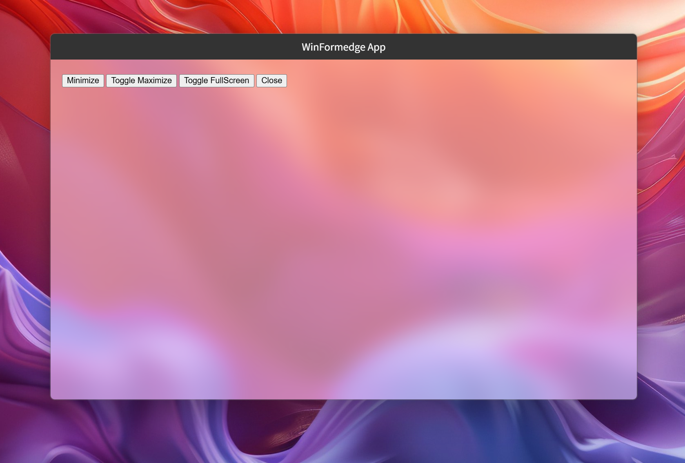
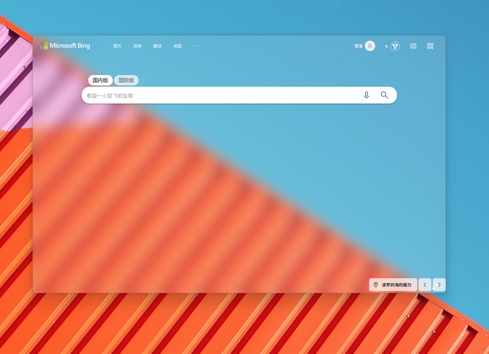

## Change Logs

### 2025/4/30

添加前端JS与窗口交互逻辑

- 重构了前端 `moveTo`, `moveBy`, `resizeTo`, `resizeBy` 方法，使其支持移动和调整窗口大小（默认情况下这些命令是不被支持的）。
- 为前端 `window` 对象添加了以下事件：
    - `windowactivated`: 当窗口被激活时触发。
    - `windowdeactivate`: 当窗口失去焦点时触发。
    - `windowresize(param:{x, y, width, height})`: 当窗口大小发生变化时触发。
    - `windowmove(param:{x, y, screenX, screenY})`: 当窗口位置发生变化时触发。
- 为前端 `window` 对象添加了 `hostWindow` 对象，用户能够在前端通过该对象访问窗口的相关属性和方法：
    - 属性 `activated - > bool`: 获取窗口是否处于激活状态。
    - 属性 `hasTitleBar - > bool`: 获取窗口是否有标题栏。
    - 属性 `windowState - > string(fullscreen|normal|maximized|minimized)`: 获取窗口当前状态。
    - 方法 `close()`: 关闭窗口。
    - 方法 `maximize()`: 最大化窗口。
    - 方法 `minimize()`: 最小化窗口。
    - 方法 `restore()`: 恢复窗口。
    - 方法 `fullscreen()`: 设置窗口全屏状态。
    - 方法 `toggleFullscreen()`: 切换窗口全屏状态。
- 为前端页面的 `html` 元素 `class` 属性添加了以下样式名称，以指示当前窗口状态，方便用户直接使用 css 进行样式设置：
    - `window--activated`: 当窗口处于激活状态时添加。
    - `window--deactivate`: 当窗口处于非激活状态时添加。
    - `window--fullscreen`: 当窗口处于全屏状态时添加。
    - `window--maximized`: 当窗口处于最大化状态时添加。
    - `window--minimized`: 当窗口处于最小化状态时添加。

### 2025/4/29

添加了JS与窗口交互逻辑

- 添加嵌入资源 `formedge.js` 文件，包含与窗口交互的 JavaScript 代码。
- 处理前端 HTML 页面中的 app-command 属性，实现了如下属性值：
  - `app-command="close"`：关闭窗口。
  - `app-command="minimize"`：最小化窗口。
  - `app-command="maximize"`：切换窗口最大化状态。
  - `app-command="fullscreen"`：切换窗口全屏状态。
- 示例项目中的 `index.html` 文件中添加了几个按钮用于测试 `app-command` 属性的功能。

### 2025/4/28

嵌入资源处理逻辑

- 修改 `MyWindow.cs` 中的 URL 设置，添加虚拟主机名映射。
- 在 `Formedge.Internal.cs` 中添加 `_setVirtualHostNameToFolderMapping` 字段及相关方法。
- 重新引入 `ManagedStream` 类，封装流操作。
- 添加 HTTP 状态码定义及获取状态短语的方法。
- 实现 MIME 类型映射和资源请求管理。
- 处理请求 URL 和相对路径的逻辑。
- 实现响应内容处理，包括 JSON 和文本内容。
- 定义嵌入文件资源选项及处理逻辑。
- 添加简单的 `index.html` 页面。
- 注册嵌入文件资源处理器的扩展方法。

### 2025/4/27

增强 Web 资源管理功能和界面设置

在多个文件中进行了重要更改，包括：

- 创建了 `ManagedStream`、`WebResourceHandler`、`WebResourceManager`、`WebResourceRequest` 和 `WebResourceResponse` 类，以增强 Web 资源的处理能力。
- 在 `WebViewCore.Browser.cs` 中集成了 Web 资源管理器的初始化和请求处理。
- 移除了 `WebViewCore.HostControl.cs` 中与窗口大小调整相关的注释代码。

### 2025/4/25

添加窗口背景类型支持和相关属性

在 `MyWindow.cs` 中添加 `WindowSystemBackdropType` 和 `DefaultBackgroundColor` 属性，并绑定事件处理程序。简化 `AppBuilder` 构造函数。修改 `Formedge.Browser.cs` 中 `DefaultBackgroundColor` 的实现，增加对 `WebView` 初始化状态的检查。更新 `Formedge.Internal.cs` 和 `Formedge.Window.cs` 以支持新的背景类型。

在 `BrowserHostForm.cs` 中移除多余的 `using` 语句，添加 `WindowAccentCompositor` 类以处理窗口背景合成，支持渐变和模糊效果。处理 `BackColor` 属性以支持透明背景。增加对 `SystemBackdropType` 的处理，允许根据不同背景类型调整窗口样式。

在 `WebViewCore.Browser.cs` 中设置 `Controller.Bounds`，并在创建 WebView2 控制器时添加延迟。处理 `WM_ERASEBKGND` 消息以确保初始化时返回正确值。定义 `SystemBackdropType` 枚举，包含多种背景类型选项。

